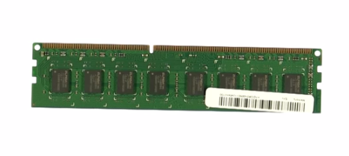
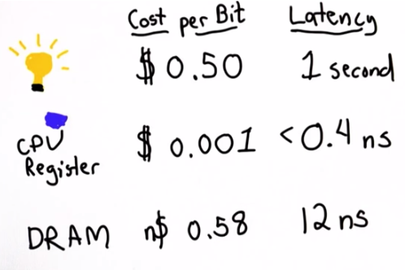

#Intro to Computer Science

**Udacity: CS 101**

---

###How Computers Store Data

In order to store data, you need two things:

1. Something that can be in more than one state (two is enough)
2. Something that can read the state of that thing

Let's say we have a light switch. Flicking a switch can change the state of the lightbulb to on or off. This means that a lightbulb, in computer-speak, can store `1 bit` of data. If we had enough lightbulbs, we could store many bits.

The second component is something that can read the lightbulb's state. In this case, that could be a photo-resistor or a human eye, for example.

While computers are much more complicated than lightbulbs, they work in the same way. The data that is stored in the processor of a computer, called the `register`, works this way for fast access and modification. However, this way of storing data doesn't work for everything:

* When a computer is turned off, the temporary data in the register is lost
* It is incredibly expensive

The other way computers store data is called `DRAM`. You've probably seen it before:

The stick in this picture has a capacity of 2 gigabytes, or approx. 1 billion bytes (a byte is equivalent to 8 bits). Computers work in powers of 2 (recall the two possible states for a lightbulb). Look below:

* "byte": 8 bits (2^3 bits)
* "kilobyte": 1024 bytes (2^10 bytes)
* "megabyte": 1024 kilobytes (2^20 bytes)
* "gigabyte": 1024 megabytes (2^30 bytes)
* "terabyte": 1024 gigabytes (2^40 bytes)
* etc...

So, how many lightbulbs would it take to store the equivalent of a 2 GB stick of RAM?

	8 bits per byte * 2^30 bytes per GB * 2 sticks of RAM = ~ 17 billion lightbulbs
	
And, remember that all of that data *temporary*; it is lost when the computer is shut down. Not all RAM is created equal; the main differentiator between types of RAM is something called *latency*, a.k.a. the time it takes to retrieve a stored value. Our 2 GB stick has a latency of around 12 nanoseconds, while some can be as low as 7 or 8. Lower latency results in a higher cost generally; our stick cost about $10 USD.

Here's a little graphic to show the cost vs. performance of different methods of storage:

One type of memory we haven't talked about yet is *hard drives*, which are how most of your data is stored on a computer. While hard drives are slower than RAM or registers, they have two important properties:

1. More storage for less cost (many hard drives store around 1TB of data for about $100)
2. Data *persists*; it is saved even after the computer shuts down

Latency on a hard drive is around 7 milliseconds (compare this to the 12 ns for DRAM)