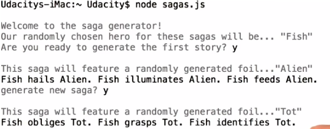

# Object-Oriented JavaScript

**Udacity: UD 015**

---

### Lesson 1: Scopes and Closures

We will learn about scope in the context of creating a game; this program will generate a "saga" for a fictional hero by:

1. Randomly picking a hero name
2. Randomly picking a foil character
3. Creating a random storyline for the two characters

Let's start by talking about lexical scope. In JavaScript, we start with the *global* scope. If I have 3 empty JavaScript files, and in one of them I declare a variable:

    var hero = aHero(); //pretend this function exists and returns a string for the hero's name

That variable is in the global scope. Anything in your project, even other files, can access that variable. Pretty simple, right?

Now, if I were to declare a function:

    var newSaga = function() {
        //stuff
    };

