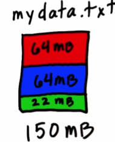

#Intro to Hadoop and MapReduce

**Udacity: UD 617**

---

###HDFS

The Hadoop Distributed File System, or HDFS as it's called, seems like a normal file system when a developer is working with it. Here's how it works under the hood:

Let's say we have a file, of 150 MB in size. Instead of storing it all in once place, HDFS works by splitting files into chunks, called "blocks", which are given unique names (think "blk_1" or "blk_4000", etc). The blocks are 64MB in size by default.

These blocks are then stored on different machines in the Hadoop cluster. In our case, we have two 64MB blocks and one 22MB one. The data is then handled and allocated by two separate pieces of software (generally running on different machines):

1. DataNode: this is where the actual data is stored
2. NameNode: stores metadata, such as where the file resides and # of blocks

Read more about the DataNode and NameNode [here](http://hadoop-gyan.blogspot.com/2012/11/hadoop-namenode-datanode-job-tracker.html).

**Data Replication**

There are several issues Hadoop needs to consider:

* Network failure: nodes can't talk to each other
* Disk failure on DataNode: loss of data
* Disk failure on NameNode: don't know where data is stored or anything about it

How does Hadoop circumvent these problems? The answer is replication. Each block is replicated *3 times* in the cluster, and the 3 nodes are chosen at random (not quite but close enough for now).

Let's say one node had a disk failure, and now one of our blocks is only replicated once (meaning there are 2 copies). The NameNode can then arrange to have the data re-replicated, so no worries!

So, what if the NameNode fails? It depends on the kind of failure. If it's a network failure, the data will only be temporarily inaccessible. But, if it dies, the data will become permanently inaccessible. For a long time, the NameNode was a huge point of failure in Hadoop. To avoid the problem, companies will use a remote file system to back up the metadata. Additionally, many production clusters have two NameNodes: one that is active, and one that is on standby, ready to take over if needed.

###Demo of HDFS

Check out [this video](https://www.youtube.com/watch?v=l0I_2nyPNZM#t=45) to see HDFS in action (we will do more of this later on). HDFS has commands that will be very familiar for Linux and Mac users comfortable with the Terminal. To get started with the virtual machine and HDFS, check out [this tutorial](https://docs.google.com/document/d/1v0zGBZ6EHap-Smsr3x3sGGpDW-54m82kDpPKC2M6uiY/edit?usp=sharing).

On to MapReduce!