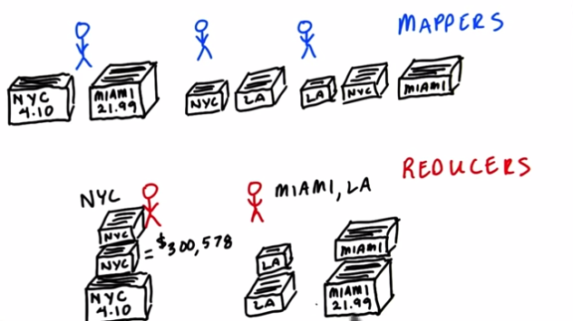

#Intro to Hadoop and MapReduce

**Udacity: UD 617**

---

###MapReduce

**Mappers and Reducers**

Now that we know how data is stored in Hadoop, let's talk about processing it. Let's say we had a large file. Processing it serially, or line-by-line, would take a long time. MapReduce is set up to process data in parallel: files are broken into chunks and analyzed at the same time.

Here's a real-world example of parallel data processing:

Let's imagine we have a giant book of sales records for a retailer from 2012. We've been asked to calculate the total amount of sales for the entire year. Lines of the ledger look like this:

    2012-01-01  London  Clothes 25.99
    2012-01-01  Miami   Music   12.15
    2012-01-02  NYC     Toys    3.10
    2012-01-03  Miami   Music   50.00
    etc...
        
Each line contains the date, store location, item bought, and sale price. We could figure things out by going through the file, writing down the location and price like this:

    London  25.99
    Miami   12.15
    NYC     3.10
        
And when we get to a duplicate location, simply adding to the sales number instead of adding a new entry. In a traditional computing environment, we'd probably use a [hash table](http://en.wikipedia.org/wiki/Hash_table) to solve this problem. The location would be the key, and the sales would be the value. There are some problems with this approach when we have a lot of data though:

* Memory
* Time

To see how a MapReduce job could help us solve this problem more efficiently, think about it this way: rather than having one person go through and add up all of the lines in the entire ledger, let's distribute the work among a bunch of people. These people will be broken up into two groups to handle our ledger:

1. Mappers
    * Each mapper takes a small chunk of the ledger, and writes down the store location and sale price on one index card.
    * Index cards are then organized into piles based on store location. For example, if we made 450 sales at the NYC location, there would be a pile of 450 NYC index cards.
    * The output of the Mappers (which is the input for the Reducers in the next step) is called the "Intermediate Records", and is in the form of key-value pairs.
    * Right before the data is passed on to the Reducers, the data is shuffled and sorted.
2. Reducers
    * Once the Mappers have finished, the Reducers collect the sets of cards that they are responsible for. Each Reducer is responsible for different stores (can be different numbers of stores per Reducer).
    * The Reducers then go through their sets of cards and add up all of the sales values to get our total sales for each store.

Conceptually, that's how MapReduce works! What if we wanted to get our final result in sorted order though? We could do this by either having one Reducer (this won't scale well), or multiple Reducers and an extra step, merging that data back together in a sorted fashion.

Let's say we got the keys "Apple", "Banana", "Grape", and "Orange" from the Mappers, and we have two Reducers. Believe it or not, we aren't guaranteed to get two keys for each Reducer! Here's more on how Hadoop handles [partitioning](https://developer.yahoo.com/hadoop/tutorial/module5.html#partitioning).

Just as we saw with HDFS and the NameNode + DataNode, there are some background processes (a.k.a. daemons) with MapReduce.

1. JobTracker: splits the work between Mappers and Reducers
2. TaskTracker: handles running the actual Map and Reduce tasks (runs on same machine as DataNodes)

Each Mapper only processes a portion of the input (broken up in what is called the "input split"). By default, Hadoop will use an HDFS block as the input split for a Mapper.

To save time and network traffic, a node that needs processing will be handled by the TaskTracker that is on that same machine.

The final output from the Reducers is writen back into HDFS, after all of this is complete.

Here's an example of running a MapReduce job: [https://www.youtube.com/watch?v=WyEkdh1Qptk](https://www.youtube.com/watch?v=WyEkdh1Qptk), and here's one that simplifies things: [https://www.youtube.com/watch?v=WyEkdh1Qptk](https://www.youtube.com/watch?v=WyEkdh1Qptk). Don't worry, we will be going through the setup and usage of Hadoop ourselves shortly!